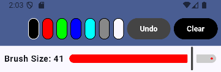
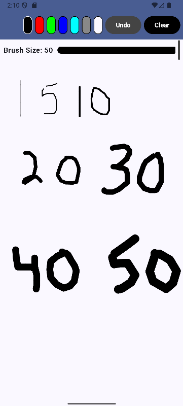

# CISC682 IA08 Project - Doodle

## Running the Program
To run the program, you simply open the project within Android Studio, then run and build the app.

## Using the Program
Within the program, you have 2 main sections:

A Tool Panels

And the Drawing Canvas

To draw on the Canvas, simply click and drag the cursor across the screen. For touchscreen devices, you would drag your finger across the screen.

The tool panel presents you with the option to either change colors by selecting the buttons: black, red, green, blue, cyan, gray, and white/erase.

The undo button will remove the last stroke made on the streen.

The clear button will remove all strokes on the screen.

Using the Brush Size Slider, brush Size will affect the line thickness of your brush strokes.

